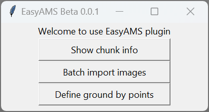
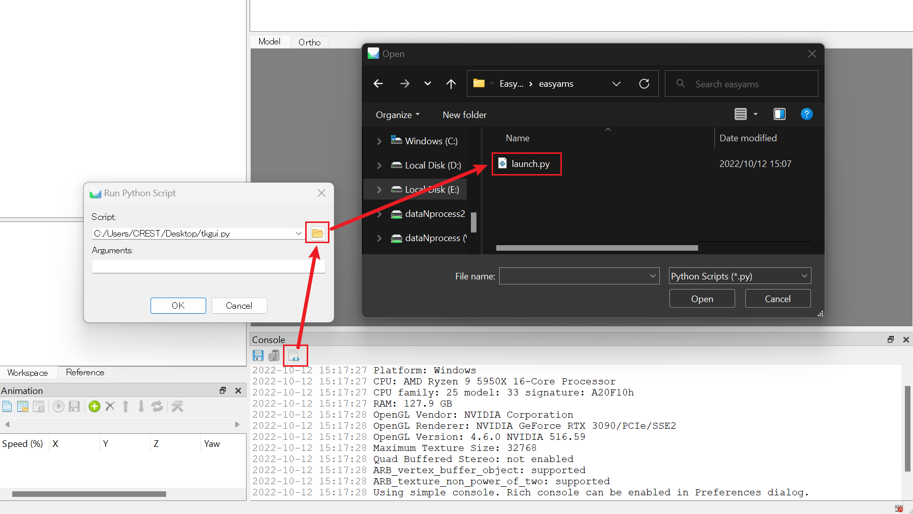

# EasyAMS

A GUI plugin tool for Agisoft Metashape with extended functions for smart agriculture.

# How to use

> Please ensure you have the `Metashape Professional License` to have access to [automation option/Built-in python scripting](https://www.agisoft.com/features/compare/) function

Clone or download the source code of this project (**no need to install python environment and any dependencies**), and launch the `EasyAMS/launch.py` script in the metashape to open the GUI.

