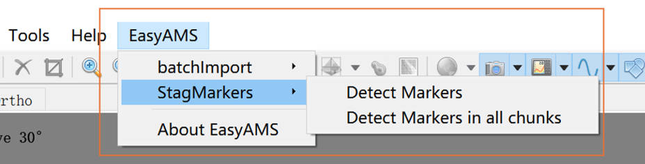
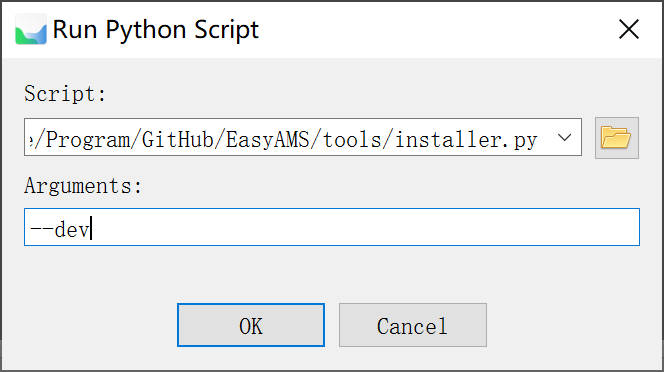

# EasyAMS

Easy Agisoft MetaShape (EasyAMS) Plugin with extended functions for smart agriculture.



# How to use

> Please ensure you have the `Metashape Professional License` to have access to [automation option/Built-in python scripting](https://www.agisoft.com/features/compare/) function

Download the `tools/installer.py` in this project to your computer, and launch the `installer.py` script in the metashape to open the GUI.


# Developer

Please clone this repo to your local path.

Then Install this plugin by chosing the installer located at `/Your/Local/Path/to/EasyAMS/tools/installer.py` with argument `--dev`. 



It will use folder at `/Your/Local/Path/to/EasyAMS/src/easyams/` as `easyams` source code package, after any modification, restart Metashape to make effects.

If you have any modification for `installer.py`, rerun the `Run Python Script` with `--dev` arguement to refresh the cached installer file at `User\AppData\Local\Agisoft\Metashape Pro\scripts\easyams_launcher.py`. Please refer 
[How to run Python script automatically on Metashape Professional start : Helpdesk Portal](https://agisoft.freshdesk.com/support/solutions/articles/31000133123-how-to-run-python-script-automatically-on-metashape-professional-start) for more details.

# Error Fixs

## Plugin installation

### 1. Python venv creation failed on Arch-Linux with `libcrypt` errors


```
[EasyAMS] [CMD] /home/crest/.local/share/Agisoft/Metashape Pro/easyams-packages-py39/bin/uv venv /home/crest/.local/share/Agisoft/Metashape Pro/easyams-packages-py39/venv --python 3.9.13
[EasyAMS] [Error]:
[EasyAMS]     × Querying Python at
[EasyAMS]     │ `/home/crest/.local/share/uv/python/cpython-3.9.13-linux-x86_64-gnu/bin/python3.9`
[EasyAMS]     │ failed with exit status exit status: 127
[EasyAMS]   
[EasyAMS]     │ [stderr]
[EasyAMS]     │ /home/crest/.local/share/uv/python/cpython-3.9.13-linux-x86_64-gnu/bin/python3.9:
[EasyAMS]     │ error while loading shared libraries: libcrypt.so.1: cannot open shared
[EasyAMS]     │ object file: No such file or directory
[EasyAMS]   
[EasyAMS] [EasyAMS] virtual isolated python venv creation failed
```

[Solution](https://github.com/electron-userland/electron-builder-binaries/issues/47): `sudo pacman -S --needed libxcrypt libxcrypt-compat` 